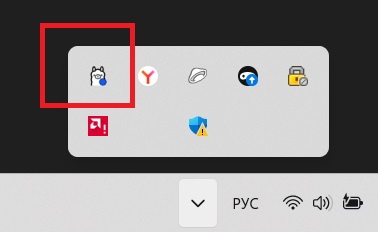
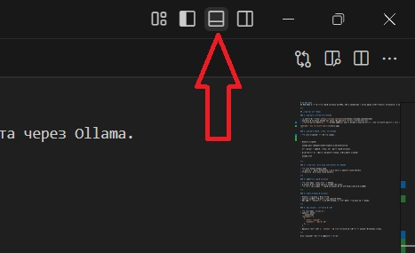
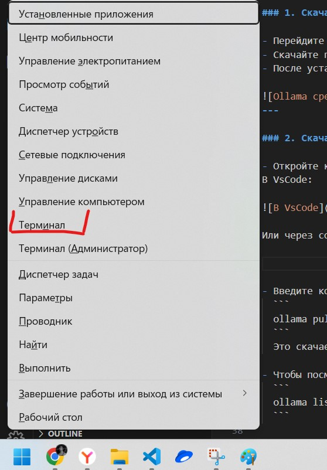
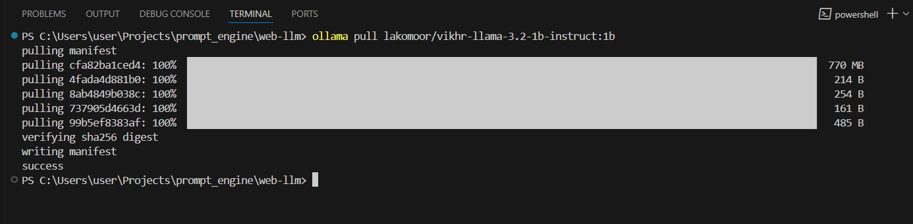
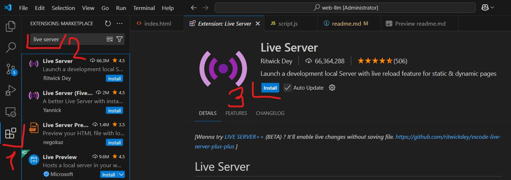
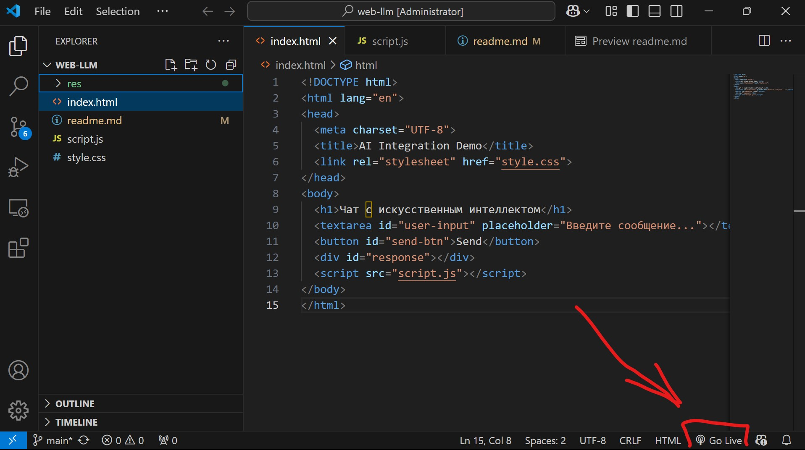
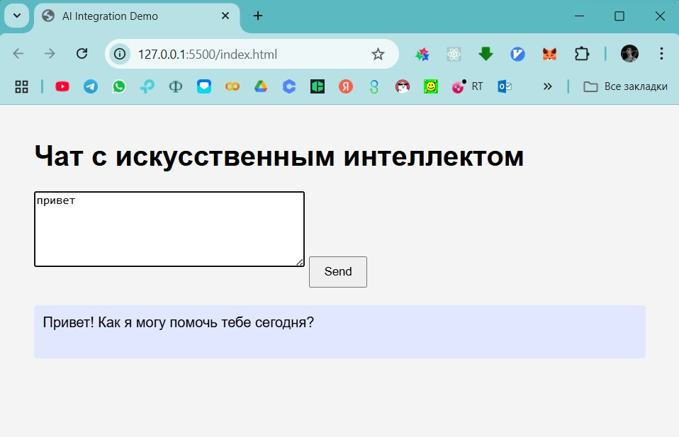

# AI Web Demo
AI Web Demo — это простое веб-приложение на HTML, CSS и JavaScript с интеграцией искусственного интеллекта через Ollama.

---

## Пошаговая инструкция

### 1. Скачайте и установите Ollama

- Перейдите по ссылке: [https://ollama.com/download](https://ollama.com/download)
- Скачайте приложение Ollama для вашей операционной системы и установите его.
- После установки убедитесь, что Ollama запущен: значок Ollama должен появиться среди системных значков (рядом с часами). 

После установки откройте командную строку (терминал) и скачайте модель 
```
ollama pull owl/t-lite
```
Список скачанных моделей можно посмотреть с помощью команды 
```
ollama list
```
=======

---

### 2. Скачайте нужную модель для Ollama

- Откройте командную строку (терминал). 
В VsCode:  



Или через сочетание клавиш Win+X:




- Введите команду:
  ```
  ollama pull lakomoor/vikhr-llama-3.2-1b-instruct:1b
  ```
  Это скачает требуемую модель для работы веб-приложения.



- Чтобы посмотреть список скачанных моделей, используйте команду:
  ```
  ollama list
  ```

---

### 3. Установите расширение Live Server для VSCode

- Откройте Visual Studio Code.
- Перейдите в раздел Extensions (Расширения) и найдите “Live Server”.
- Установите расширение “Live Server”.



---

### 4. Запустите веб-приложение

- Откройте файл `index.html` в VSCode.
- В нижнем правом углу нажмите кнопку “Go Live”.  



- Откроется ваш браузер с веб-приложением по адресу http://127.0.0.1:5500/

---

### 5. Использование приложения

- Введите сообщение в поле ввода.
- Нажмите кнопку “Отправить” или клавишу Enter.
- Ваш запрос отправится через API Ollama, и ответ будет отображён на странице.



---

### 6. Как изменить системный промпт

- Откройте файл `script.js`.
- Найдите раздел:
  ```javascript
  "messages": [
    {
      "role": "system",
      "content": ` Ваш промпт `
    }, ... 
  ]
  ```
- Замените текст внутри ``content`` на свой системный промпт — это изменит поведение модели.

---

Если возникнут вопросы — пишите в тг-чат в ветку Вопросы к преподавателю.
